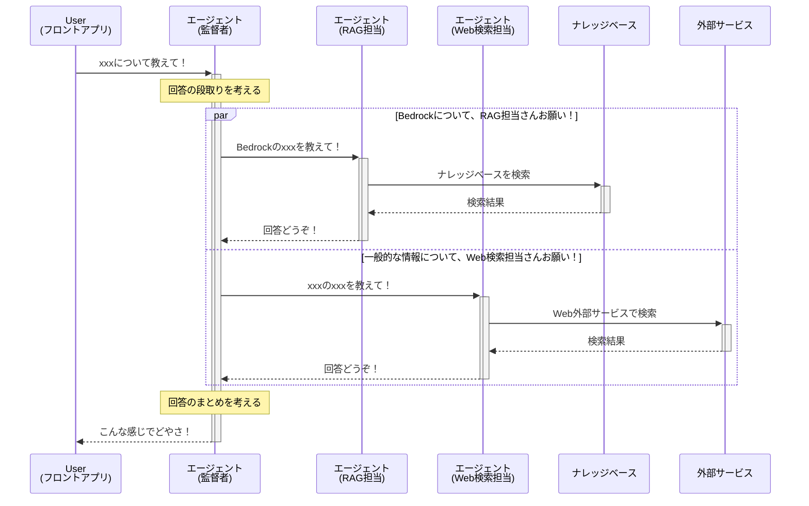

## はじめに

「わが家の AI 技術顧問」のハンズオンを無事に完了しました！🎉
https://aws.amazon.com/jp/builders-flash/202503/create-ai-advisor-with-bedrock/

このハンズオンでは、Amazon Bedrock を活用し、ドキュメント（ナレッジベース）と Web 検索（公開情報）を組み合わせることで、より的確なアドバイスを提供できる AI システムを体験できました。

ハンズオン完了時の記念スクリーンショットはこちらです。どんな質問に対しても、AI 技術顧問が的確な回答を生成してくれました。


無事に完走できたため、ふりかえりも兼ねて、ハンズオンの思い出を記録に残そうと思います。

## AI 技術顧問の処理の流れは？

（ハンズオン資料から引用した構成図）


今回構築した AI 技術顧問は、ユーザーからの質問に対し、ナレッジベースと Web 検索を状況に応じて使い分け、的確な回答を生成する点が素晴らしいと感じました。その処理の流れを、ざっくりとしたシーケンス図で表現すると以下のようになる、と理解しています。



## ハンズオンの備忘あれこれ

ハンズオンの手順は非常に丁寧で、迷うことなく進めることができましたが、いくつか補足しておきたい点や、個人的に気づいたことがありましたので、備忘録として残しておきます。

### 使ったモデルの特徴は？

各種モデルについてはまだ学習中ということもあり、今回利用したモデルの主な特徴をまとめました。

| モデル名                        | 主な特徴                                                |
| :------------------------------ | :------------------------------------------------------ |
| Amazon Titan Text Embeddings V2 | 自然言語をベクトルに変換する埋め込みモデル              |
| Anthropic Claude 3.5 Haiku      | Claude シリーズの中で特に高速なモデル                   |
| Anthropic Claude 3.5 Sonnet     | Claude シリーズの中で性能と速度のバランスが取れたモデル |

### Lambda レイヤーのパッケージングお作法

Tavily という外部サービスを利用する際に、tavily-python ライブラリを Lambda レイヤーとしてパッケージングする手順について、

```bash
mkdir python
pip install tavily-python --target python #エラーは無視してOK
zip -r layer.zip python
```

python ディレクトリにライブラリを格納するのは、以下の AWS 公式ドキュメントに記載されているとおり、Lambda レイヤーのパッケージングのお作法です。

https://docs.aws.amazon.com/ja_jp/lambda/latest/dg/packaging-layers.html#packaging-layers-paths

参考までに、[powertools-lambda-python](https://github.com/aws-powertools/powertools-lambda-python)の Lambda レイヤーをローカルにダウンロードして展開すると、python ディレクトリの中に必要なライブラリが格納されていることが確認できます。


なお、tavily-python のインストール時に発生するエラーは、依存ライブラリである botocore が必要とする urllib3 のバージョンと、 tavily-python のインストール時に導入される urllib3 のバージョンが競合するために起こります。

### フロントアプリで必要な追加ライブラリ

ハンズオンの手順では、フロントエンドアプリケーションに必要なライブラリとして streamlit のインストールしますが、追加で boto3 と python-dotenv のインストールも必要になりました。

自分は普段から目的ごとに Python の仮想環境を作成するため、ライブラリインストール前のエラーを踏まえ、ライブラリをインストールしました。


```
# 必要なライブラリをインストール
pip install boto3 streamlit python-dotenv
```

参考までに、venv を使用した仮想環境の作成手順は以下のとおりです。

```bash
# 仮想環境の作成と有効化
python3 -m venv .venv
source .venv/bin/activate

# pipのバージョン最新化
(.venv) % pip install --upgrade pip
# ライブラリインストール前の状態
(.venv) % pip list
Package Version
------- -------
pip     25.1

# 必要なライブラリをインストール
(.venv) % pip install boto3 streamlit python-dotenv
# ライブラリインストール後の状態
(.venv) % pip list
Package                   Version
------------------------- -----------
altair                    5.5.0
attrs                     25.3.0
blinker                   1.9.0
boto3                     1.38.6
botocore                  1.38.6
cachetools                5.5.2
certifi                   2025.4.26
charset-normalizer        3.4.1
click                     8.1.8
gitdb                     4.0.12
GitPython                 3.1.44
idna                      3.10
Jinja2                    3.1.6
jmespath                  1.0.1
jsonschema                4.23.0
jsonschema-specifications 2025.4.1
MarkupSafe                3.0.2
narwhals                  1.37.1
numpy                     2.2.5
packaging                 24.2
pandas                    2.2.3
pillow                    11.2.1
pip                       25.1
protobuf                  6.30.2
pyarrow                   20.0.0
pydeck                    0.9.1
python-dateutil           2.9.0.post0
python-dotenv             1.1.0
pytz                      2025.2
referencing               0.36.2
requests                  2.32.3
rpds-py                   0.24.0
s3transfer                0.12.0
six                       1.17.0
smmap                     5.0.2
streamlit                 1.45.0
tenacity                  9.1.2
toml                      0.10.2
tornado                   6.4.2
typing_extensions         4.13.2
tzdata                    2025.2
urllib3                   2.4.0

# ライブラリをファイルに出力
(.venv) % pip freeze > .\requirements.txt
```

### おかたづけのプラス α

環境を綺麗にするためには、ハンズオン手順の削除対象リソースに加えて、`CloudWatch` と `IAM` 関連のリソースも削除すると良きです。✅ の箇所が追加リソースにあたります。

- Amazon Bedrock
  - エージェント : bedrock-master, web-search-master, your-tech-advisor
  - ナレッジベース : bedrock-docs
- Amazon S3
  - 汎用バケット : s3://bedrock-docs-(あなたのニックネーム)-(YYYYMMDD)
- Amazon RDS
  - データベース : knowledgebasequickcreateaurora-XXX-auroradbcluster-xxxxxxxxxx
- AWS Lambda
  - 関数 : tavily_search-xxxxx
  - レイヤー : Tavily
- ✅ CloudWatch
  - ロググループ : /aws/lambda/tavily_search-xxxxx
- ✅ IAM
  - ロール : AmazonBedrockExecutionRoleForAgents_xxxxx(3 つ), AmazonBedrockExecutionRoleForKnowledgeBase_xxxxx, tavily_search-xxxxx-role-xxxxx

## さいごに

今回のハンズオンを通して、Amazon Bedrock を活用することで、手軽に AI システムを構築できることを実感できました。「わが家の AI 技術顧問」というテーマも非常に面白く、実生活での応用を想像しながら取り組むことができました。今後、Bedrock をさらに探求していきたいと思います。
ではでは。
